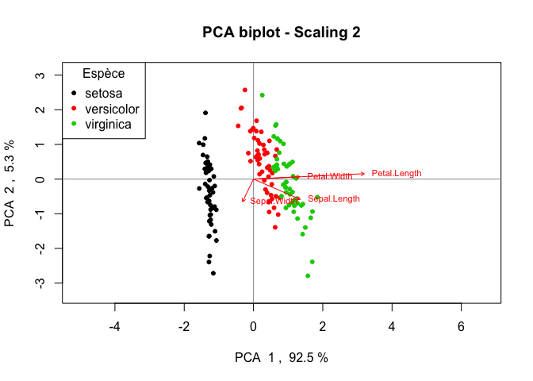

# A propos

Ce repo contient une version modifiée de la fonction `cleanplot.pca()`
dont la version originelle se trouve également dans ce dossier. Cette
nouvelle version, nommée `cleanpot.pca.color()` permet de différencier
les points par couleurs en fonction d’une variable catégorielle (i.e :
un `factor`).

Pour l’utiliser, il suffit de copier le texte en cliquant sur le lien
[`cleanplot.pca.color.R`](cleanplot.pca.color.R) et dans l’enregistrer
dans un fichier dans le répertoire courant dans lequel travaille `R`
(utilisez la fonction `getwd()` pour le trouver). Puis vous charger la
fonction en utilisant `source("nom_du_fichier_contenant_la_fonction.R")`
et vous n’avez plus qu’à appeler `cleanplot.pca.color()`.

# Exemple

Je souhaite faire une ACP sur les données du jeu `iris` inclu dans `R`.

``` r
library(vegan)
```

    ## Loading required package: permute

    ## Loading required package: lattice

    ## This is vegan 2.5-3

``` r
source("cleanplot.pca.color.R")

data <- iris

species <- iris$Species # Je récupère les espèces dans un vecteurs.
species <- as.factor(species) # Je transforme mes données en facteur.

data <- data[, -5] # Je retire la colonne espèce pour pouvoir faire mon ACP.

data_pca <- rda(data)
```

`cleanplot.pca.color()` a de nouveaux arguements qui sont tous
facultatifs :

  - `grouping.factor` Un vecteur contenant les facteurs servant à
    colorer les points (le nombre d’éléments dans votre vecteur doit
    être égal au nombre de ligne du tableau utilisé dans la
    fonction`rda()`);
  - `grouping.title` Le titre de la boite de légende que souhaitez
    donner ;
  - `pos.legend` La position boîte de légende. Doit avoir l’une des
    valeurs suivantes `bottomright`, `bottom`, `bottomleft`, `left`,
    `topleft`, `top`, `topright`, `right` ou `center`.

Par exemple, cela donne quelque chose comme cela :

``` r
cleanplot.pca.color(data_pca, 
                    grouping.factor = species,
                    grouping.title = "Espèce",
                    pos.legend = "topleft")
```

<!-- -->

Si je ne donne pas ces nouveaux arguments, `cleanplot.pca.color()` se
comporte de la même manière que `cleanplot.pca()`.

``` r
cleanplot.pca.color(data_pca)
```

<!-- -->
